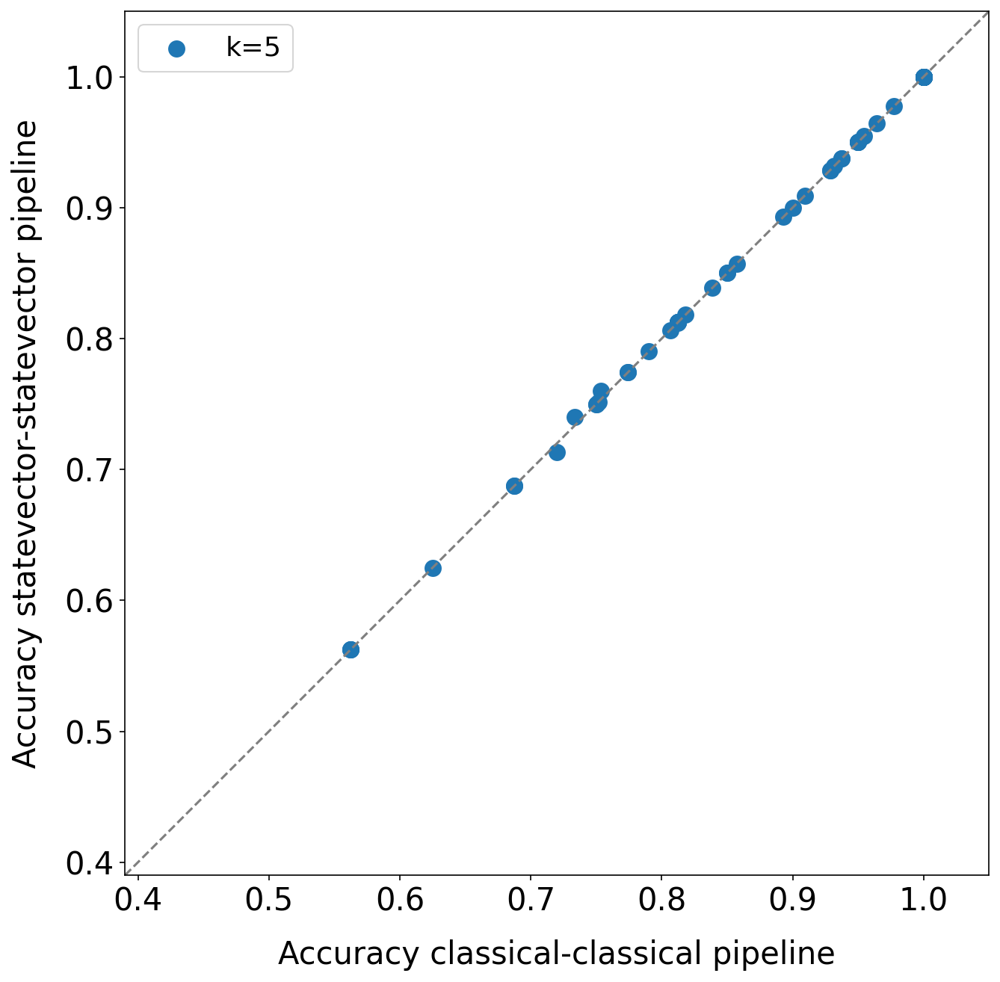

# Implementation and empirical evaluation of a quantum machine learning pipeline for local classification
This repository provides the code for the "Implementation and empirical evaluation of a quantum machine learning pipeline for local classification" article.

## 1. Prerequisites
In order to run the code, you need to have Python 3 installed. In particular, Python 3.8.10 has been used for the experiments presented in the paper. If you do not have Python 3 on your machine, we suggest to install Anaconda Python.

You may also want to create a virtual environment before performing the setup step. If you are using Anaconda Python, the shell command is the following:
```shell
conda create -n "venv" python=3.8.10
```

Eventually, if you want to use the online (simulated or quantum) backends provided by IBM, you must create an IBM Quantum account.


## 2. Setup
Once you have met the prerequisites, download the repository and move inside the project root folder. From the command line, this is the sequence of commands:
```shell
git clone https://github.com/ZarHenry96/quantum-ml-pipeline.git
cd quantum-ml-pipeline
```

Then, activate the virtual environment, if you are using one (for Anaconda, the command is `conda activate venv`), and install the required modules by runnning the following command:
```shell
pip install -r requirements.txt
```

Finally, to exploit the online IBM backends, you have to run the following instructions inside a Python shell (the IBM API token can be retrieved from the IBM Quantum dashboard):
```python
from qiskit import IBMQ
IBMQ.save_account('insert_your_IBM_API_TOKEN_here')
```

## 3. Execution
To make the execution of the experiments easier, the `run_experiments.sh` and the `run_baseline.sh` bash scripts are provided. The former is meant for the experiments involving the quantum pipeline and the quantum binary classifier, whereas the latter for the ones involving the baseline methods.

In detail, to run the quantum pipeline on the "15 qubits" datasets in all the execution modality combinations described in the article, the command is the following:
```shell
./run_experiments.sh experiments/quantum_knn_classifier_pipeline datasets_exp/15_qubits_limit [res-subfolder-name]
```
Specifically, by default, the number of nearest neighbors selected is 5; this value can be modified inside the bash script (`K_NN` variable), as well as the number of processes run in parallel (`NUM_PROCESSES` variable). Instead, if you want to use the "32 qubits" datasets, just replace the datasets path with the correct one. By default, the results are stored in the `results` directory, which is automatically created. The `res-subfolder-name` optional parameter allows specifying a subpath inside the `results` folder where to store the results.

Analogously, to run the quantum binary classifier on the "15 qubits" datasets in the two execution modalities presented in the paper, the command is the following:
```shell
./run_experiments.sh experiments/quantum_classifier_only datasets_exp/15_qubits_limit [res-subfolder-name]
```
Actually, if you want to reproduce the results illustrated in the article, the (02) dataset should be removed from the "15 qubits" datasets folder when executing the quantum binary classifier alone. Regarding the execution on the "32 qubits" datasets, the procedure is the same as for the quantum pipeline.

Eventually, to run all the baseline methods presented in the paper on the "15 qubits" datasets, the command is the following:
```shell
./run_baseline.sh baseline/baseline.template datasets_exp/15_qubits_limit [res-subfolder-name]
```
To use the "32 qubits" datasets, the procedure is the same as in the previous cases.

\
**Note #1:** if you want to run the quantum pipeline (or the quantum binary classifier) in a specific modality on a specific dataset, you have to create a `.json` configuration file (starting from the template files) by replacing the placeholders in the chosen template file with the desired values. After that, the command to run the pipeline (classifier) is the following:
```shell
python main.py CONFIG-FILE-PATH
```
Concerning the baseline methods, the procedure is the same (notice that all the methods to be run and the related parameters are specified in a single file). The execution command is the following:
```shell
python baseline/baseline_methods.py CONFIG-FILE-PATH
```
\
**Note #2:** all the preprocessed datasets ready for the experiments are located inside the `datasets_exp` folder, whereas the `datasets_orig` folder contains their original versions (the wrong instances in the Iris dataset have been corrected in both places). As described in the paper, all datasets have been taken from the UCI Machine Learning Repository. The preprocessing has been performed using the `preprocess_dataset.py` script located inside the `pre_post_processing` directory.

## 4. Results Postprocessing
At the end of the execution, before plotting anything, it is necessary to collect the results from the various experiments folders in order to make them more tractable. To this end, the `collect_multi_exp_results.py` script (located inside the `pre_post_processing` folder) is provided. For instance, to collect all quantum-pipeline-related results for the "15 qubits" datasets with k=5, the command is the following:
```shell
python pre_post_processing/collect_multi_exp_results.py --root-res-dir results/quantum_pipeline/15_qubits_k_5
```
Here, it is assumed that all the results of the experiments of interest are located inside a dedicated folder, namely `results/quantum_pipeline/15_qubits_k_5`. The outputs are two `.json` files that are suitable for plotting operations. In the case of baseline results, the `--baseline` flag must be enabled.

Once the results have been collected, it is possible to generate scatter plots through the `plot_scatterplots.py` script located in the same folder as the previous one. For instance, given the `results_per_method.json` file produced at the previous point, the command to generate a scatter plot comparing the "classical-classical" and the "statevector-statevector" modality is the following:
```shell
python pre_post_processing/plot_scatterplots.py \
       --x-res-files results/quantum_pipeline/15_qubits_k_5/results_per_method.json \
       --x-keys "classical_classical" \
       --y-res-files results/quantum_pipeline/15_qubits_k_5/results_per_method.json \
       --y-keys "statevector_statevector" \
       --res-files-partitions 1 \
       --legend-labels "k=5" \
       --x-label "Accuracy classical-classical pipeline" \
       --y-label "Accuracy statevector-statevector pipeline" \
       --out-file "results/scatterplots/example_scatter.png" \
       --stats-test "wilcoxon" \
       --stats-out-file "results/stats_scatterplots/example_scatter_stats.csv"
```
The output is the following (assuming that the random seed for the folds generation has not been changed):
<p align="center">
       
</p>

By exploiting the procedure just described and the parameters provided by the `plot_scatterplots.py` script, it is possible to generate all the plots shown in the paper.

**Note:** the generation of the scatter plots for the experiments for which multiple runs have been executed (e.g., the "simulation"-related ones) requires an additional step. In particular, after the results collection, the `compute_runs_avg_std_per_fold.py` script (located inside the `pre_post_processing` folder) should be executed to compute the fold-by-fold average accuracy. The script in question takes as input the folders containing the `results_per_method.json` files related to the various runs and provides as output a `results_per_method_runs_avg_std_per_fold.json` file that can be given as input to the plotting script.
